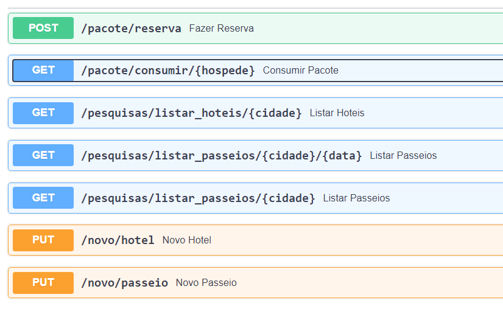
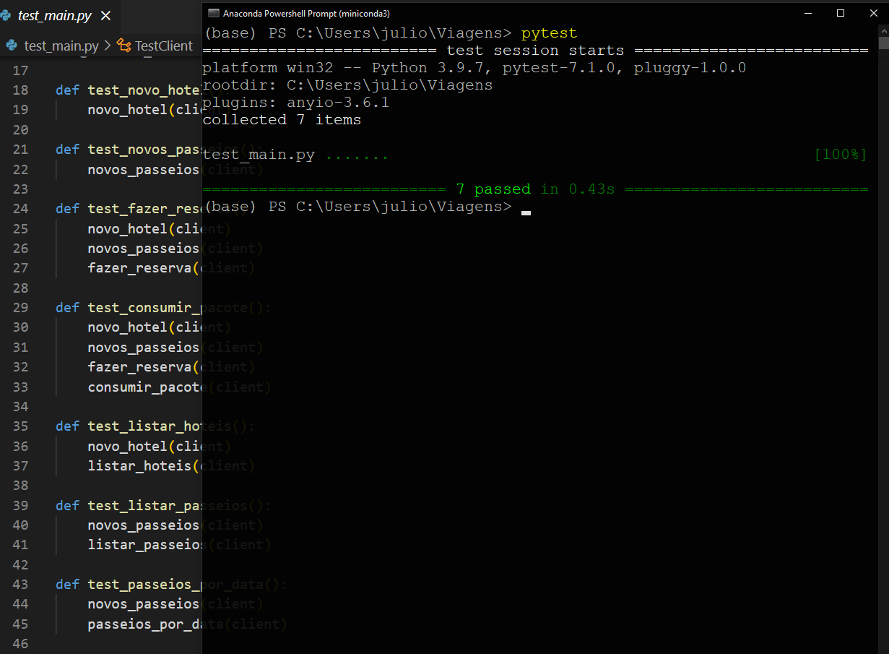

API _Viagens_ (estudo)
---
**por Júlio Cascalles**

---

O objetivo dessa API é simular uma agência de viagens, onde será possível:
* Pesquisar hotéis disponíveis numa determinada cidade;
* Pesquisar os passeios por cidade;
* Pesquisar os passeios por cidade e numa data específica;
* Fazer reserva num hotel e comprar pacote de passeios;
* Consumir o pacote de passeios;
* Cadastrar novos hotéis;
* Cadastrar novos passeios;

## Regras
> Hotel
* Só pode ser feita uma reserva se houver vaga no hotel;
* Check-in: Só ocorre se houver reserva para o hóspede;
* Tamanho do hotel: Determina o número de quartos;

> Passeio
* Acontece num determinado dia da semana;
* Os dias da semana devem ser um desses:
    - seg, ter, qua, qui, sex, sab ou dom
* O formato da data (quando houver) deve ser _dd-mm--yyyy_

> Pacote
* Ao fazer a reserva, a lista de passeios deve conter os nomes separados **por vírgula**;
* Só serão considerados os passeios encontrados;
* Se nenhum passeio for encontrado, o pacote não poderá ser contratado;
* Se o hotel não for encontrado ou se não houver vagas, a reserva não poderá ser feita;
* Será retornado o número do quarto reservado para o hóspede
    - Os números de quarto vão de zero até o tamanho do hotel menos 1.

> Hóspede
* Ao consumir o primeiro passeio, o hóspede dá entrada no hotel (check-in);
* Ao consumir o último passeio, o hóspede deixa o hotel (check-out).
* Os passeios de um hóspede são ordenados por dia da semana

## Banco de dados, ORM e frameworks...
* Neste projeto o banco de dados é MongoDB, acessado localmente;
* Nenhum ORM de terceiros foi utilizado
    - Em vez disso, criei minha classe de acesso no melhor estilo "clean code"
* As dependências utilizadas são:
    - pyMongo
    - pydantic
    - FastAPI
    - uvicorn

## Testes unitários

Os seguintes testes foram realizados:
* Novo Hotel
* Novos Passeios
* Listar Hotel
* Listar Passeios
* Passeios por Data
* Fazer Reserva
* Consumir Pacote
> Os dados utilizados nos testes estão em testes/const.py

Foram testados...
* O retorno de sucesso (status code == 200)
* O valor esperado (nome do hotel, nome do passeio...)

